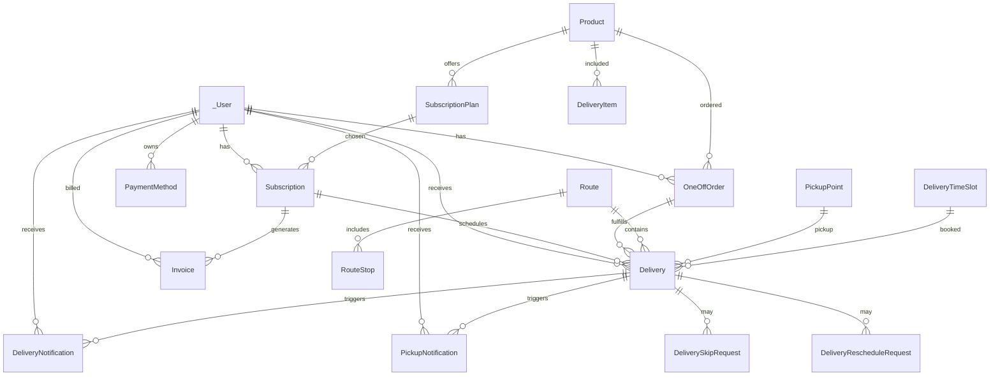

## EWA — Base de Datos (Back4App/Parse) y API

### Objetivo
Diseño de esquemas, relaciones, endpoints y user stories para implementar la plataforma en Back4App (Parse Server). El panel admin usará `_User.isAdmin: true` para privilegios (sin sistema de puntos).

### Convenciones
- **Clases**: PascalCase singular (por ejemplo: `Product`, `Subscription`).
- **Campos**: camelCase (`createdAt` ya existe en Parse).
- **Referencias**: punteros Parse con sufijo natural (por ejemplo: `user` → pointer a `_User`).
- **IDs**: usar `objectId` de Parse; si se requiere ID legible, agregar campo `code`/`slug`.
- **Estados**: strings de enums definidos abajo.
- **Fechas**: campos Date de Parse.
- **Admin**: `_User.isAdmin: boolean`.

### Control de Acceso (ACL y Auth)
- Login con Parse: `_User` + sesiones. El cliente guardará el token en `localStorage` (ya se hace en `/api/login`).
- ACL por defecto: lectura pública y escritura restrigida al owner; endpoints admin validan `currentUser.isAdmin === true`.
- Clases críticas (`Invoice`, `PaymentMethod`) con lectura y escritura restringida al `user` owner y a admins.

### Esquemas de Datos (Parse Classes)

1) `_User` (core) — Perfil extendido
- Campos extra:
  - `name: string`
  - `phone?: string`
  - `isAdmin: boolean` (default: false)
  - `address?: Object { street, city, state?, zipCode?, country, instructions? }`
  - `businessInfo?: Object { businessName?, businessType?, taxId?, contactPerson? }`
  - `preferences?: Object { deliveryPreference, communicationPreference, timeSlotPreference }`
  - `notes?: string`
  - `isActive?: boolean`

2) `Product`
- `name: string`
- `sizeOz: number`
- `sku: string` (único)
- `price: number`
- Índices: `sku` único; búsqueda por `name`.

3) `SubscriptionPlan` (equivale a Plan enriquecido)
- `name: string`
- `description: string`
- `product: Pointer<Product>`
- `productName: string`
- `productSize: string`
- `frequency: string ('weekly'|'biweekly'|'monthly')`
- `price: number`
- `originalPrice?: number`
- `discount?: number`
- `minQuantity: number`
- `maxQuantity: number`
- `features: Array<string>`
- `isPopular?: boolean`
- `isActive: boolean`

4) `Subscription`
- `plan: Pointer<SubscriptionPlan>`
- `user: Pointer<_User>`
- `status: string ('active'|'paused'|'cancelled')`
- `product?: Pointer<Product>`
- `quantity: number`
- `address: string`
- `nextDeliveryDate?: Date`
- `frequency: string ('weekly'|'biweekly'|'monthly')`
- `createdAt: Date` (Parse)
- Índices: `user`, `status`, `nextDeliveryDate`.

5) `OneOffOrder`
- `product: Pointer<Product>`
- `user: Pointer<_User>`
- `status: string ('pending'|'processing'|'delivered'|'cancelled')`
- `orderDate: Date`
- `deliveryDate?: Date`
- `address: string`
- `quantity: number`
- `price: number`
- Índices: `user`, `status`, `orderDate`.

6) `Delivery`
- `subscription: Pointer<Subscription>`
- `user: Pointer<_User>`
- `order?: Pointer<OneOffOrder>`
- `route?: Pointer<Route>`
- `pickupPoint?: Pointer<PickupPoint>`
- `deliveryType: string ('home_delivery'|'pickup_point')`
- `status: string ('scheduled'|'in_transit'|'out_for_delivery'|'delivered'|'failed'|'cancelled'|'skipped'|'rescheduled')`
- `scheduledDate: Date`
- `timeSlot?: Pointer<DeliveryTimeSlot>`
- `actualDeliveryDate?: Date`
- `estimatedArrivalTime?: string`
- `actualArrivalTime?: string`
- `deliveryAddress: Object { street, city, state, zipCode, lat?, lng?, instructions? }`
- `recipient: Object { name, phone, email }`
- `items: Array<Object { product: Pointer<Product>, productName, quantity, size }>`
- `driverId?: string` `driverName?: string` `driverPhone?: string`
- `notes?: string` `customerNotes?: string`
- `deliveryPhoto?: string` `signature?: string`
- `skipReason?: string` `rescheduledFrom?: Date` `rescheduledTo?: Date` `rescheduledReason?: string` `failureReason?: string`
- `attempts: number` `maxAttempts: number`
- Índices: `user`, `subscription`, `status`, `scheduledDate`, `route`.

7) `DeliveryTimeSlot`
- `label: string`
- `startTime: string` `endTime: string`
- `isAvailable: boolean`
- `maxCapacity: number` `currentBookings: number`

8) `PickupPoint`
- `name: string`
- `address: string`
- `city: string` `state: string` `zipCode: string`
- `lat: number` `lng: number`
- `isActive: boolean`
- `operatingHours: Object { monday..sunday: { open, close, closed? } }`
- `capacity: number` `currentLoad: number`
- `contactPhone?: string` `instructions?: string`
- `features: Array<string>`

9) `Route`
- `name: string`
- `area: string`
- `driverId: string` `driverName: string`
- `status: string ('active'|'in-progress'|'completed'|'scheduled'|'pending')`
- `deliveryDate: Date`
- `startTime: Date` `estimatedEndTime: Date` `actualEndTime?: Date`

10) `RouteStop` (normaliza paradas)
- `route: Pointer<Route>`
- `address: string`
- `lat: number` `lng: number`
- `status: string ('pending'|'completed')`
- `eta?: string`

11) `DeliveryNotification`
- `delivery: Pointer<Delivery>`
- `user: Pointer<_User>`
- `type: string ('scheduled'|'out_for_delivery'|'delivered'|'failed'|'rescheduled'|'pickup_ready')`
- `title: string` `message: string`
- `sentAt: Date` `readAt?: Date`
- `channels: Array<string ('email'|'sms'|'push')>`
- `metadata?: Object { estimatedArrival?, trackingUrl?, driverContact?, pickupCode? }`

12) `PickupNotification`
- `pickupPoint: Pointer<PickupPoint>`
- `delivery: Pointer<Delivery>`
- `user: Pointer<_User>`
- `pickupCode: string`
- `status: string ('ready'|'collected'|'expired')`
- `availableUntil: Date` `createdAt: Date` `collectedAt?: Date` `collectedBy?: string`

13) `DeliverySkipRequest`
- `delivery: Pointer<Delivery>` `subscription: Pointer<Subscription>` `user: Pointer<_User>`
- `reason: string ('vacation'|'business_trip'|'temporarily_not_needed'|'address_change'|'other')`
- `customReason?: string`
- `skipDate: Date`
- `requestedAt: Date`
- `status: string ('pending'|'approved'|'rejected')`
- `approvedBy?: Pointer<_User>` `approvedAt?: Date` `rejectionReason?: string`

14) `DeliveryRescheduleRequest`
- `delivery: Pointer<Delivery>` `subscription: Pointer<Subscription>` `user: Pointer<_User>`
- `originalDate: Date` `requestedDate: Date` `timeSlot?: Pointer<DeliveryTimeSlot>`
- `reason: string ('not_available'|'address_change'|'preference_change'|'emergency'|'other')`
- `customReason?: string`
- `requestedAt: Date`
- `status: string ('pending'|'approved'|'rejected')`
- `approvedBy?: Pointer<_User>` `approvedAt?: Date` `rejectionReason?: string`

15) `PaymentMethod`
- `user: Pointer<_User>`
- `type: string ('card'|'paypal'|'bank_transfer')`
- `isDefault: boolean`
- `cardLast4?: string` `cardBrand?: string` `cardExpMonth?: number` `cardExpYear?: number`
- `paypalEmail?: string`
- `bankName?: string` `bankLast4?: string`
- `billingAddress: Object { street, city, state, zipCode, country }`
- `isActive: boolean`

16) `Invoice`
- `subscription: Pointer<Subscription>` `user: Pointer<_User>`
- `invoiceNumber: string` (único)
- `status: string ('draft'|'pending'|'paid'|'failed'|'cancelled')`
- `amount: number` `taxAmount: number` `totalAmount: number`
- `currency: string`
- `dueDate: Date` `paidAt?: Date`
- `paymentMethod?: Pointer<PaymentMethod>`
- `items: Array<Object { description, quantity, unitPrice, totalPrice }>`
- Índices: `user`, `subscription`, `status`, `invoiceNumber` único.

17) `BlogPost` (opcional marketing)
- `title: string` `slug: string (único)` `excerpt: string` `content: string`
- `author: string` `date: Date` `imageUrl?: string`

### Diagrama ER (alto nivel)


Nota: `DeliveryItem` está embebido en `Delivery.items` pero se muestra como entidad para relación con `Product`.

### Endpoints REST (Next.js API / futura migración a Cloud Code)

- Autenticación
  - POST `/api/login` → Auth (token + user)
  - POST `/api/logout`

- Productos
  - GET `/api/products` → [Product[]]
  - POST `/api/products` (admin) → crea Product

- Planes de suscripción
  - GET `/api/plans` → [Plan|SubscriptionPlan[]]
  - POST `/api/plans` (admin) → crea SubscriptionPlan

- Usuarios
  - GET `/api/users` (admin) → [User]
  - POST `/api/users` (admin) → crea User (con `isAdmin` opcional)
  - GET `/api/users/:id`
  - PATCH `/api/users/:id` (admin o owner)
  - DELETE `/api/users/:id` (admin)

- Suscripciones
  - GET `/api/subscriptions` (filtro `userId` opcional)
  - POST `/api/subscriptions` (admin o owner)
  - PATCH `/api/subscriptions/:id` (admin)
  - GET `/api/subscriptions/:id/history` → [SubscriptionHistory]

- Pedidos únicos (OneOff)
  - GET `/api/oneoffs` (filtro `userId`)
  - POST `/api/oneoffs` (owner)
  - GET `/api/oneoffs/:id`
  - PATCH `/api/oneoffs/:id` (admin)

- Entregas
  - GET `/api/deliveries` (filtros: `startDate`, `endDate`, `status`)
  - PATCH `/api/deliveries/:id` → actualizar `status`, `driver`, `notes`, etc.
  - POST `/api/deliveries/:id/skip-requests` → DeliverySkipRequest
  - POST `/api/deliveries/:id/reschedule-requests` → DeliveryRescheduleRequest

- Rutas
  - GET `/api/routes` (filtro `date`)
  - POST `/api/routes` (admin)
  - GET `/api/routes/:id`
  - GET `/api/routes/:id/stops`

- Pickup Points y Time Slots
  - GET `/api/pickup-points`
  - POST `/api/pickup-points` (admin)
  - GET `/api/time-slots`
  - POST `/api/time-slots` (admin)

- Notificaciones y Métricas
  - GET `/api/metrics` → { mrr, churn, fulfillmentRate }
  - GET `/api/metrics/mrr` | `/api/metrics/churn` | `/api/metrics/fulfillmentRate`
  - GET `/api/deliveries/:id/notifications`

- Pagos y Facturación
  - GET `/api/payment-methods` (owner)
  - POST `/api/payment-methods` (owner)
  - GET `/api/invoices` (owner/admin, filtros por `userId`, `subscriptionId`, `status`)
  - GET `/api/invoices/:id`

Especificaciones de payload/response se alinean con `packages/types/src/index.ts` (mantener compatibilidad).

### Enums (referencia)
- `DeliveryStatus`: `scheduled | in_transit | out_for_delivery | delivered | failed | cancelled | skipped | rescheduled`
- `Plan.frequency` y `Subscription.frequency`: `weekly | biweekly | monthly`
- `User.preferences.deliveryPreference`: `home_delivery | pickup_point`
- `User.preferences.communicationPreference`: `email | sms | both`
- `User.preferences.timeSlotPreference`: `morning | afternoon | evening | flexible`

### Índices sugeridos
- `Subscription`: por `user`, `status`, `nextDeliveryDate`.
- `Delivery`: por `user`, `subscription`, `status`, `scheduledDate`, `route`.
- `Invoice`: `invoiceNumber` único; `user`, `subscription`, `status`.
- `Product`: `sku` único; `name` con index para búsquedas.

### Ejemplos de objetos (JSON)

`_User` (admin)
```json
{
  "username": "admin@ewa.com",
  "email": "admin@ewa.com",
  "name": "Admin User",
  "phone": "(787) 987-6543",
  "isAdmin": true,
  "isActive": true
}
```

`Subscription`
```json
{
  "plan": {"__type":"Pointer","className":"SubscriptionPlan","objectId":"plan1"},
  "user": {"__type":"Pointer","className":"_User","objectId":"u3"},
  "status": "active",
  "quantity": 2,
  "address": "789 Oak St, Sometown, USA",
  "nextDeliveryDate": {"__type":"Date","iso":"2025-06-01T00:00:00.000Z"},
  "frequency": "biweekly"
}
```

`Delivery`
```json
{
  "subscription": {"__type":"Pointer","className":"Subscription","objectId":"sub2"},
  "user": {"__type":"Pointer","className":"_User","objectId":"u3"},
  "deliveryType": "home_delivery",
  "status": "scheduled",
  "scheduledDate": {"__type":"Date","iso":"2025-08-13T00:00:00.000Z"},
  "deliveryAddress": {"street":"789 Oak St","city":"Sometown","state":"USA","zipCode":"00911"},
  "recipient": {"name":"Jane Smith","phone":"555-555-5555","email":"jane@example.com"},
  "items": [{"productName":"Small Box Water","quantity":2,"size":"500ml"}],
  "attempts": 0,
  "maxAttempts": 3
}
```

### User Stories (resumen)
- Cliente
  - Como cliente, puedo registrarme/iniciar sesión.
  - Como cliente, puedo ver y comprar un plan de suscripción y pedidos únicos.
  - Como cliente, puedo ver mi próxima entrega, reprogramarla o solicitar saltarla.
  - Como cliente, puedo seleccionar un punto de pickup y horario.
  - Como cliente, puedo gestionar mis métodos de pago y ver facturas.

- Admin (`isAdmin: true`)
  - Como admin, puedo gestionar productos, planes y usuarios.
  - Como admin, puedo ver/filtrar suscripciones, entregas y rutas; asignar conductores.
  - Como admin, puedo aprobar/rechazar `DeliverySkipRequest` y `DeliveryRescheduleRequest`.
  - Como admin, puedo consultar métricas (MRR, churn, fulfillment rate).

### Roadmap de implementación (Back4App)
1. Extender `_User` con campos extra e inicializar `isAdmin`.
2. Crear clases base: `Product`, `SubscriptionPlan`, `Subscription`, `OneOffOrder`.
3. Crear logística: `Delivery`, `Route`, `RouteStop`, `PickupPoint`, `DeliveryTimeSlot`.
4. Crear soporte: `DeliveryNotification`, `PickupNotification`, `DeliverySkipRequest`, `DeliveryRescheduleRequest`.
5. Crear pagos: `PaymentMethod`, `Invoice`.
6. Configurar ACL y Cloud Code (hooks) para consistencia e índices.

### Notas
- Mantener tipos compartidos en `packages/types` como contrato de API.
- En Next.js API actual hay mocks; al migrar a Back4App, reimplementar handlers usando Parse SDK/REST.


